# Quick Devops Tools installation using Terraform

## Installation requirements :

> - You need to have terraform installed. It can be found here : [Terraform install](https://developer.hashicorp.com/terraform/tutorials/docker-get-started/install-cli)
> - You need to have Docker Desktop or Docker Engine installed

### This will automatically install the following :

- Quick installation of Jenkins
- Quick installation of Sonarqube

### Run the following commands to initialize :

- Terraform init
- Terraform apply

> Containers will listen on port 8080 and 9000 for both Jenkins and Sonarqube on your local machine

### Easy to delete instance

- Simply run a Terraform destroy command

### Bare in mind !

- In order to use Jenkins to its full potential, you should create agents that are adapted to your needs (php CLI, node, composer...)
- Master should never be used as agents for security purposes
- Git projects must be linked with webhooks : [learn more about git webhooks](https://docs.github.com/en/webhooks/about-webhooks)
- Sonarqube must be linked to your Jenkins pipelines in order to start testing : [Learn more about Sonarqube webhooks](https://docs.sonarsource.com/sonarqube/latest/project-administration/webhooks/)
- default user/password is admin. You will be prompted to change them on install