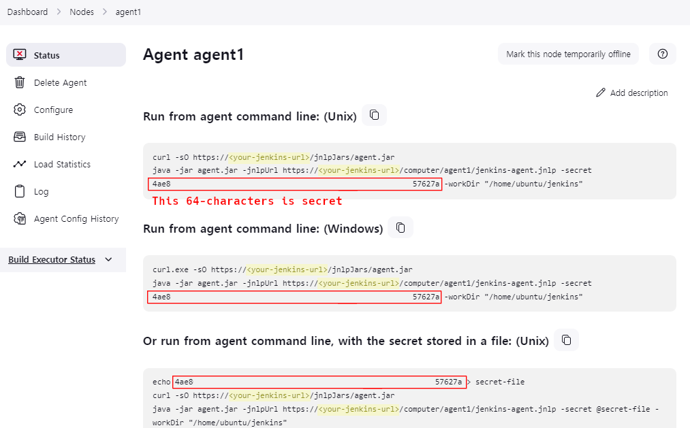

# Quick Devops Tools installation using Terraform

>

## Installation requirements :

- You need to have Terraform installed : [Terraform install](https://developer.hashicorp.com/terraform/tutorials/docker-get-started/install-cli)
- You need to have Docker Desktop or Docker Engine installed : [Docker install](https://docs.docker.com/engine/install/)

### This will automatically do the following :

- Quick installation of Jenkins
- Quick installation of Sonarqube with postgres database (/!\ credentials unsafe, change them here : [creds](./modules/variables.tf))

### Run the following commands to initialize :
```
Terraform init
```
```
Terraform apply
```

> Containers will listen on port 8080 and 9000 for both Jenkins and Sonarqube on your local machine

### Jenkins configuration

- You will need to install the SonarQube Scanner plugin. Go to Manage Jenkins > System and set SonarQube URL :

```
http://172.216.0.5:9000

```

### Initiating Jenkins agent

- To create an agent go to Manage jenkins > Node :


- Then create a new node :


- Save the node, then head to your newly created agent and get the secret :



#### Run the following command

```
 docker run --init --network=dev-tools-network --name=node_agent mechameleon/node_agent:0.0.3 -url http://devops-pipeline:8080 -workDir=/home/jenkins/agent -secret <your_secret> -name node_agent
```
> /!\ : don't forget to replace <your_secret> by the secret provided by jenkins (i.e image above) !

### Setting up a Pipeline

- Create a docker hub personal access token [link to your settings](https://hub.docker.com/settings/general)


- Make sure you copy somewhere (you won't see it anymore afterwards)


- Create a credential for your docker hub pat by going to Manage Jenkins > Credentials > New credential


- In the pipeline script, simply copy paste the content of the jenkinsfile [here](https://github.com/Manianise/spiritsPresentation)

### Setting up Sonarqube

- Create a SonarQube webhook by going in Administration > Webhooks > Create


- Setup a SonarQube project (default creds are admin/admin)


- Copy/paste your id in the corresponding step in the Jenkins pipeline


### Easy to delete instance

- Simply run a Terraform destroy command

## Bare in mind !

- Master should never be used as an agent for security purposes. Change settings in "system administration > number of executors" to 0
- Git projects must be linked with webhooks : [learn more about git webhooks](https://docs.github.com/en/webhooks/using-webhooks/creating-webhooks)
- Sonarqube must be linked to your Jenkins pipelines in order to start testing : [Learn more about Sonarqube webhooks](https://docs.sonarsource.com/sonarqube/latest/project-administration/webhooks/)